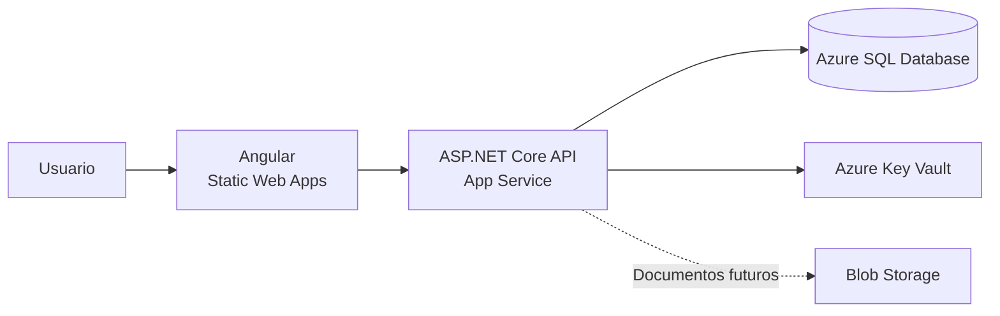

<div align="center">

## EduApoyos

[](https://github.com/LeidyH15/EduApoyos/actions/workflows/backend-ci.yml)
[](https://github.com/LeidyH15/EduApoyos/actions/workflows/frontend-ci.yml)

### Plataforma para la gestión de solicitudes de apoyo económico estudiantil


<br>

**Solución full stack con ASP.NET Core 8, Angular 22, autenticación JWT, control por roles, trazabilidad, pruebas automatizadas y pipelines CI.**

</div>

---

## Información general

**Fecha de elaboración:** julio de 2026

**Repositorio:** [github.com/LeidyH15/EduApoyos](https://github.com/LeidyH15/EduApoyos)

Una institución de educación superior requiere centralizar la gestión de solicitudes de apoyo económico, como becas, créditos y subsidios. El proceso se realizaba mediante hojas de cálculo y correos electrónicos, lo que ocasionaba reprocesos, pérdida de información y falta de trazabilidad.

**EduApoyos** permite a los asesores registrar y administrar estudiantes y solicitudes, mientras que cada estudiante puede consultar el estado de sus solicitudes desde un portal de autogestión y descargar una constancia.

El repositorio contiene la API REST, el frontend Angular, las migraciones, los scripts SQL, las pruebas automatizadas, Docker Compose y los flujos de integración continua.

---

## Funcionalidades

- Registro e inicio de sesión con roles `Asesor` y `Estudiante`.
- Autenticación mediante JWT Bearer con expiración configurable.
- CRUD de estudiantes con información personal y académica.
- Creación, consulta y actualización de solicitudes de apoyo.
- Tipos de apoyo: `Beca`, `Crédito` y `Subsidio`.
- Flujo controlado de estados:

```text
Pendiente → En revisión → Aprobada
                       └→ Rechazada
```

- Historial auditable de cambios de estado.
- Listados con filtros por estado, tipo de apoyo y fechas.
- Paginación en estudiantes y solicitudes.
- Portal para consultar las solicitudes propias del estudiante.
- Descarga segura de constancias en formato de texto.
- Restricción de acceso por rol y propiedad del recurso.
- Errores estandarizados mediante `ProblemDetails`.
- Validaciones mediante DataAnnotations y reglas de dominio.
- Documentación interactiva mediante Swagger/OpenAPI.
- Interfaz web responsive construida con Angular Material.
- Guards de rutas para autenticación y autorización por rol.
- Interceptor HTTP para adjuntar el JWT a las solicitudes.
- Indicadores de carga y retroalimentación visual de errores y confirmaciones.

---

## Arquitectura

La solución utiliza una arquitectura limpia dividida por responsabilidades:

```text
EduApoyos
├── src
│   ├── EduApoyos.Domain
│   ├── EduApoyos.Application
│   ├── EduApoyos.Infrastructure
│   └── EduApoyos.Api
├── tests
│   ├── EduApoyos.UnitTests
│   └── EduApoyos.IntegrationTests
├── database
│   └── scripts
├── frontend
│   └── eduapoyos-web
│       ├── src/app/core
│       ├── src/app/features
│       ├── src/app/layout
│       └── src/app/shared
├── .github
│   └── workflows
│       ├── backend-ci.yml
│       └── frontend-ci.yml
├── docker-compose.yml
├── coverlet.runsettings
└── EduApoyos.sln
```

| Capa | Responsabilidad |
|---|---|
| `Domain` | Entidades, enumeraciones, excepciones y reglas del negocio. No depende de infraestructura. |
| `Application` | Contratos, DTOs, modelos de respuesta, abstracciones y casos de uso. |
| `Infrastructure` | EF Core, SQL Server, Identity, JWT, repositorios, servicios y generadores de archivos. |
| `Api` | Controladores, autenticación, middleware de errores, Swagger y configuración HTTP. |
| `UnitTests` | Pruebas aisladas de entidades y reglas de dominio. |
| `IntegrationTests` | Pruebas de flujos HTTP, autenticación, autorización, persistencia y descargas. |
| `frontend/eduapoyos-web` | SPA Angular organizada por funcionalidades, componentes compartidos, servicios, guards e interceptores. |

La dirección de dependencias mantiene el dominio independiente de frameworks y detalles externos.

---

## Patrones de diseño

### 1. Repository

Los contratos `IEstudianteRepository` e `ISolicitudApoyoRepository` abstraen el acceso a datos. Las implementaciones con Entity Framework Core permanecen en Infrastructure.

**Motivo de elección:**

- Evita que las reglas de negocio dependan directamente de EF Core.
- Centraliza consultas y operaciones de persistencia.
- Facilita las pruebas y la sustitución de la tecnología de almacenamiento.
- Mantiene separadas las responsabilidades de negocio y acceso a datos.

### 2. Strategy

Las estrategias de estado encapsulan las transiciones permitidas de una solicitud:

- `EstrategiaSolicitudPendiente`
- `EstrategiaSolicitudEnRevision`

**Motivo de elección:**

- Cada estado aplica sus propias reglas de transición.
- Evita una cadena extensa de condicionales en el servicio.
- Permite agregar nuevos estados sin modificar toda la lógica existente.
- Garantiza que cada cambio genere su registro en el historial.

### 3. Factory

`IConstanciaSolicitudFactory` define la creación de constancias y `ConstanciaSolicitudTextoFactory` genera el archivo descargable.

**Motivo de elección:**

- Separa la construcción del documento de los controladores y servicios.
- Permite sustituir el formato de texto por PDF sin cambiar las reglas de negocio.
- Centraliza el nombre, contenido y tipo MIME del archivo.

> [!TIP]
> También se emplea una unidad de trabajo mediante `IUnidadTrabajo` para coordinar la confirmación de cambios en la base de datos.

---

## Tecnologías utilizadas

| Componente | Tecnología |
|---|---|
| Backend | .NET 8 y ASP.NET Core Web API |
| ORM | Entity Framework Core 8 - Code First |
| Base de datos | SQL Server 2022 |
| Seguridad | ASP.NET Core Identity y JWT Bearer |
| Documentación | Swagger / OpenAPI con Swashbuckle |
| Validación | DataAnnotations y reglas de dominio |
| Pruebas | xUnit, Moq y WebApplicationFactory |
| Cobertura | Coverlet y ReportGenerator |
| Contenedores | Docker y Docker Compose |
| Frontend | Angular 22 y TypeScript |
| Sistema de diseño | Angular Material |
| Estado y formularios | Signals y Reactive Forms |
| Pruebas frontend | Vitest y Angular TestBed |
| CI | GitHub Actions |

---

## Ejecución local

### Prerrequisitos

- [.NET SDK 8](https://dotnet.microsoft.com/download/dotnet/8.0)
- [Docker Desktop](https://www.docker.com/products/docker-desktop/)
- Git
- Visual Studio o un IDE compatible con .NET 8
- Node.js 24.18 o una versión admitida por Angular 22
- npm 11
- Visual Studio Code recomendado para el frontend

Compruebe las instalaciones:

```powershell
dotnet --version
docker --version
docker compose version
git --version
node --version
npm --version
```

### 1. Clonar el repositorio

```powershell
git clone https://github.com/LeidyH15/EduApoyos.git
cd EduApoyos
```

### 2. Configurar SQL Server para Docker

Cree un archivo `.env` en la raíz. Este archivo está excluido de Git:

```env
SQL_SA_PASSWORD=<SU_PASSWORD_SEGURA_DE_SQL_SERVER>
```

La contraseña debe cumplir las reglas de complejidad de SQL Server: mayúsculas, minúsculas, números y caracteres especiales.

Inicie el contenedor:

```powershell
docker compose up -d
docker compose ps
```

Para consultar los registros:

```powershell
docker compose logs --tail 50 sqlserver
```

Para detenerlo sin eliminar los datos:

```powershell
docker compose stop
```

### 3. Configurar secretos de desarrollo

La cadena de conexión, la clave JWT y la contraseña inicial no se guardan en `appsettings.json` ni en Git.

```powershell
dotnet user-secrets set "ConnectionStrings:DefaultConnection" "Server=localhost,1433;Database=EduApoyosDb;User Id=sa;Password=<SU_PASSWORD_SEGURA_DE_SQL_SERVER>;TrustServerCertificate=True;" --project src/EduApoyos.Api/EduApoyos.Api.csproj

dotnet user-secrets set "Jwt:Key" "<CLAVE_JWT_SEGURA_DE_AL_MENOS_32_BYTES>" --project src/EduApoyos.Api/EduApoyos.Api.csproj

dotnet user-secrets set "SeedAsesor:Password" "<PASSWORD_SEGURA_DEL_ASESOR>" --project src/EduApoyos.Api/EduApoyos.Api.csproj
```

Compruebe la existencia de las claves configuradas:

```powershell
dotnet user-secrets list --project src/EduApoyos.Api/EduApoyos.Api.csproj
```

> [!WARNING]
> No publique el contenido de User Secrets, el archivo `.env`, contraseñas ni tokens JWT.

### 4. Restaurar y compilar

```powershell
dotnet restore EduApoyos.sln
dotnet build EduApoyos.sln
```

### 5. Crear o actualizar la base de datos

```powershell
dotnet ef database update --project src/EduApoyos.Infrastructure/EduApoyos.Infrastructure.csproj --startup-project src/EduApoyos.Api/EduApoyos.Api.csproj
```

Si la herramienta `dotnet-ef` no está instalada:

```powershell
dotnet tool install --global dotnet-ef --version 8.0.24
```

### 6. Ejecutar la API

Desde Visual Studio, configure `EduApoyos.Api` como proyecto de inicio y ejecute el perfil `https`.

Desde PowerShell:

```powershell
dotnet run --project src/EduApoyos.Api/EduApoyos.Api.csproj --launch-profile https
```

Swagger estará disponible en:

```text
https://localhost:7120/swagger
```

### 7. Instalar y ejecutar el frontend

En otra terminal:

```powershell
Set-Location frontend/eduapoyos-web
npm ci
npm start
```

La aplicación web estará disponible en:

```text
http://localhost:4200
```

El servidor de desarrollo utiliza `proxy.conf.json` para enviar las solicitudes `/api` a la API local. Por ello, la API debe estar ejecutándose en `https://localhost:7120`.

Para compilar y ejecutar las pruebas del frontend:

```powershell
npm run build
npm test -- --watch=false
```

---

## Autenticación y roles

Al iniciar la aplicación se crean los roles `Asesor` y `Estudiante`, junto con el asesor inicial configurado mediante:

```text
SeedAsesor:NombreCompleto
SeedAsesor:Email
SeedAsesor:Password
```

Valores públicos predeterminados:

```text
Nombre: Asesor Inicial
Correo: asesor@eduapoyos.local
```

La contraseña debe configurarse con User Secrets.

Para utilizar endpoints protegidos desde Swagger:

1. Ejecute `POST /api/auth/login`.
2. Copie el valor de `token`.
3. Seleccione **Authorize**.
4. Ingrese solamente el token, sin escribir la palabra `Bearer`.
5. Ejecute el endpoint protegido.

---

## Frontend Angular

El frontend se encuentra en `frontend/eduapoyos-web` y utiliza componentes standalone, carga diferida de rutas y Angular Material como sistema de diseño.

### Vistas implementadas

| Vista | Ruta | Funcionalidad |
|---|---|---|
| Inicio de sesión | `/login` | Autenticación, manejo de errores y redirección según el rol. |
| Panel del asesor | `/asesor/solicitudes` | Tabla paginada, filtros por estado y tipo de apoyo, y acceso al detalle. |
| Nueva solicitud | `/solicitudes/nueva` | Formulario reactivo con validación y creación para asesor o estudiante. |
| Detalle de solicitud | `/solicitudes/{id}` | Información, historial, cambio de estado para el asesor y descarga de constancia. |
| Portal del estudiante | `/estudiante/portal` | Solicitudes propias, resumen por estado, paginación y acceso al detalle. |

### Seguridad en el cliente

- `authGuard` impide acceder a rutas protegidas sin una sesión válida.
- `roleGuard` limita las vistas según los roles `Asesor` y `Estudiante`.
- El interceptor HTTP agrega el encabezado `Authorization: Bearer <token>`.
- La sesión se conserva en `sessionStorage` y se elimina al cerrar sesión o expirar el JWT.
- La contraseña nunca se guarda en el navegador.
- La API conserva la autoridad sobre los permisos y la propiedad de los recursos.

### Experiencia de usuario

- Indicadores de carga durante las operaciones HTTP.
- Mensajes visuales para confirmaciones y errores.
- Validaciones de formularios antes de enviar datos.
- Navegación y menús adaptados al rol autenticado.
- Diseño responsive con Angular Material y SCSS.

---

## Endpoints principales

### Autenticación

| Método | Ruta | Descripción | Acceso |
|---|---|---|---|
| `POST` | `/api/auth/register` | Registra un estudiante y devuelve un JWT. | Público |
| `POST` | `/api/auth/login` | Autentica al usuario y devuelve un JWT. | Público |

### Estudiantes

| Método | Ruta | Descripción | Acceso |
|---|---|---|---|
| `GET` | `/api/estudiantes` | Lista estudiantes con paginación. | Asesor |
| `GET` | `/api/estudiantes/{id}` | Consulta el detalle de un estudiante. | Asesor |
| `POST` | `/api/estudiantes` | Crea el estudiante y su usuario de acceso. | Asesor |
| `PUT` | `/api/estudiantes/{id}` | Actualiza los datos del estudiante. | Asesor |
| `DELETE` | `/api/estudiantes/{id}` | Elimina un estudiante sin solicitudes. | Asesor |

### Solicitudes

| Método | Ruta | Descripción | Acceso |
|---|---|---|---|
| `GET` | `/api/solicitudes` | Lista y filtra solicitudes con paginación. | Asesor |
| `GET` | `/api/solicitudes/{id}` | Obtiene la solicitud y su historial. | Asesor / propietario |
| `POST` | `/api/solicitudes` | Crea una solicitud de apoyo. | Asesor / Estudiante |
| `PUT` | `/api/solicitudes/{id}` | Actualiza una solicitud pendiente. | Asesor / propietario |
| `PATCH` | `/api/solicitudes/{id}/estado` | Cambia el estado aplicando Strategy. | Asesor |
| `GET` | `/api/solicitudes/{id}/constancia` | Descarga la constancia en texto. | Asesor / propietario |
| `GET` | `/api/estudiantes/{id}/solicitudes` | Consulta las solicitudes del portal. | Asesor / propietario |

Los endpoints de listado admiten paginación. El listado de solicitudes también permite filtros por estado, tipo de apoyo y rango de fechas.

---

## Manejo de errores y validaciones

La API utiliza un manejador global de excepciones que genera respuestas `application/problem+json` compatibles con Problem Details.

| Estado HTTP | Uso principal |
|---|---|
| `400 Bad Request` | Datos o parámetros inválidos. |
| `401 Unauthorized` | Token ausente, inválido o credenciales incorrectas. |
| `403 Forbidden` | El usuario no tiene permisos sobre el recurso. |
| `404 Not Found` | El recurso solicitado no existe. |
| `409 Conflict` | Correo o documento duplicado. |
| `422 Unprocessable Entity` | Regla de negocio no satisfecha. |
| `500 Internal Server Error` | Error inesperado sin exposición de detalles internos. |

Cada respuesta controlada contiene `status`, `title`, `detail`, `instance` y `traceId`.

---

## Base de datos y ejercicios SQL

El modelo se genera con migraciones Code First e incluye las entidades principales:

- Usuarios e información de Identity.
- Estudiantes.
- Solicitudes de apoyo.
- Historial de estados.

Los scripts requeridos se encuentran en:

```text
database/scripts
```

Incluyen:

1. Solicitudes pendientes con más de cinco días sin actualización, ordenadas por antigüedad.
2. Total de solicitudes agrupadas por estado y tipo de apoyo durante el último mes.
3. Creación y justificación de un índice no agrupado sobre solicitudes.

### Índice no agrupado

El índice sobre estado y fecha de actualización optimiza las consultas que identifican solicitudes pendientes antiguas y reduce la necesidad de recorrer completamente la tabla.

Su diseño también beneficia filtros operativos frecuentes del asesor, manteniendo como columnas incluidas los datos necesarios para resolver el listado sin accesos adicionales innecesarios.

---

## Pruebas y cobertura

La solución contiene pruebas unitarias y de integración para:

- Reglas de creación y actualización de solicitudes.
- Transiciones de estado mediante Strategy.
- Autenticación correcta e incorrecta.
- Autorización mediante roles y JWT.
- CRUD completo de estudiantes.
- Flujo completo de solicitudes.
- Respuestas ProblemDetails.
- Descarga de constancias.
- Restricción de acceso a solicitudes ajenas.
- Tiempo de respuesta inferior a 800 ms para una consulta normal después del calentamiento.
- Uso de Moq para aislar dependencias en pruebas unitarias.

Ejecute todas las pruebas:

```powershell
dotnet test EduApoyos.sln
```

Estado actual:

```text
26 pruebas aprobadas
0 pruebas fallidas
Cobertura de líneas: 84%
Cobertura de métodos: 93.9%
Cobertura de ramas: 55.7%
```

### Generar el reporte de cobertura

```powershell
Remove-Item TestResults -Recurse -Force -ErrorAction SilentlyContinue
Remove-Item CoverageReport -Recurse -Force -ErrorAction SilentlyContinue

dotnet test EduApoyos.sln --settings coverlet.runsettings --results-directory TestResults

reportgenerator "-reports:TestResults/**/coverage.cobertura.xml" "-targetdir:CoverageReport" "-reporttypes:Html;TextSummary"

Get-Content CoverageReport/Summary.txt
```

Las migraciones generadas por EF Core se excluyen del cálculo porque no contienen lógica escrita manualmente.

### Pruebas del frontend

Las pruebas cubren componentes, navegación, formularios, consultas de solicitudes, manejo de errores y comportamiento por rol.

```powershell
Set-Location frontend/eduapoyos-web
npm test -- --watch=false
```

Estado actual:

```text
38 pruebas aprobadas
0 pruebas fallidas
```

---

## Consideraciones de seguridad

- Las contraseñas se almacenan mediante ASP.NET Core Identity, no como texto plano.
- La API valida emisor, audiencia, firma y expiración del JWT.
- La clave JWT debe contener como mínimo 32 bytes.
- El acceso se controla mediante roles y propiedad del recurso.
- Las credenciales locales se mantienen fuera del repositorio.
- Los errores internos no exponen trazas ni información sensible al cliente.
- Swagger se habilita exclusivamente en el ambiente de desarrollo.
- El frontend no almacena contraseñas y elimina la sesión cuando el token expira.
- Los guards protegen la navegación y el interceptor centraliza el envío del JWT.

---

## Decisiones y mejoras futuras

- La constancia se genera actualmente como texto para cumplir el requisito sin introducir dependencias innecesarias. El Factory permite incorporar PDF posteriormente.
- El frontend está implementado como una SPA Angular y consume la API mediante servicios HTTP tipados.
- Se puede incorporar renovación de tokens, recuperación de contraseña y verificación de correo.
- Se puede incorporar generación de constancias en PDF y pruebas end-to-end del navegador.
- Para producción se recomienda utilizar un gestor de secretos, HTTPS administrado, observabilidad centralizada y CI/CD.
- Las mediciones de rendimiento deben ejecutarse en un ambiente equivalente al despliegue objetivo.

---

## Propuesta de despliegue en Microsoft Azure

> [!NOTE]
> El proyecto no se encuentra desplegado en Azure. Esta sección documenta
> los servicios que se utilizarían en un ambiente productivo y la
> justificación de cada elección.

### Arquitectura propuesta



### Servicios seleccionados

| Servicio | Uso propuesto | Nivel sugerido | Justificación |
|---|---|---|---|
| **Azure Static Web Apps** | Hospedaje del frontend Angular. | Free para demostración; Standard para producción. | Está orientado a aplicaciones SPA, se integra con GitHub Actions, permite HTTPS y facilita las rutas propias de Angular. |
| **Azure App Service** | Hospedaje de la API ASP.NET Core 8. | Linux Basic B1 para demostración o una carga inicial pequeña. | Permite publicar la API sin administrar servidores, habilitar HTTPS, configurar variables de entorno y escalar el servicio cuando aumente la demanda. |
| **Azure SQL Database** | Base de datos relacional del sistema. | Basic para demostración; Standard S0 o superior para producción. | Es compatible con SQL Server y Entity Framework Core, proporciona respaldos administrados, alta disponibilidad y escalamiento según la carga. |
| **Azure Key Vault** | Administración de secretos de producción. | Standard. | Evita guardar la cadena de conexión, la clave JWT y las credenciales iniciales dentro del código fuente o de los archivos versionados. |
| **Azure Blob Storage** | Almacenamiento futuro de documentos o constancias persistentes. | StorageV2 con redundancia LRS para una carga inicial. | Es adecuado para archivos no estructurados. Actualmente la constancia se genera en memoria y se descarga directamente, por lo que este servicio no es obligatorio en la versión actual. |
| **Application Insights** | Monitoreo de la API. | Basado en consumo. | Permitiría consultar errores, tiempos de respuesta, solicitudes y trazas para comprobar el requisito de rendimiento. |

### Configuración propuesta de la API

La API se publicaría en un App Service para Linux con:

- Runtime de .NET 8.
- HTTPS Only habilitado.
- Entorno `Production`.
- Health Check sobre un endpoint de disponibilidad.
- CORS limitado al dominio del frontend.
- Migraciones ejecutadas como una tarea controlada de despliegue.
- Identidad administrada habilitada para acceder a Key Vault.
- Registros y telemetría enviados a Application Insights.

Las configuraciones sensibles se entregarían como referencias de
Key Vault o variables de entorno:

```text
ConnectionStrings__DefaultConnection
Jwt__Key
Jwt__Issuer
Jwt__Audience
Jwt__ExpirationMinutes
SeedAsesor__Email
SeedAsesor__Password
```

Ninguno de estos valores de producción debe almacenarse en Git.

### Configuración propuesta de Azure SQL Database

Para una demostración académica se podría utilizar el nivel **Basic**,
debido a su bajo volumen esperado. Para producción se recomienda comenzar
con **Standard S0** y aumentar el nivel después de revisar:

- Cantidad de solicitudes concurrentes.
- Uso de CPU y almacenamiento.
- Tiempos de respuesta.
- Crecimiento de solicitudes e historial.
- Necesidades de recuperación y continuidad.

El acceso al servidor se restringiría mediante reglas de red y una cadena
de conexión protegida en Key Vault.

### Seguridad en Azure

- Todos los accesos externos se realizarían mediante HTTPS.
- Los secretos se administrarían en Azure Key Vault.
- App Service utilizaría identidad administrada para consultar secretos.
- Azure SQL Database no expondría credenciales en el repositorio.
- Los roles `Asesor` y `Estudiante` continuarían validándose mediante JWT.
- El estudiante solamente podría consultar sus propios recursos.
- Los registros no incluirían contraseñas, tokens ni cadenas de conexión.

### Integración y entrega continua

El archivo `.github/workflows/backend-ci.yml` implementa el pipeline de
GitHub Actions y ejecuta automáticamente:

1. Obtención del repositorio.
2. Configuración del SDK de .NET.
3. Restauración de dependencias.
4. Compilación en modo Release.
5. Ejecución de pruebas unitarias y de integración.
6. Publicación de la API.
7. Generación del artefacto `eduapoyos-api`.

El archivo `.github/workflows/frontend-ci.yml` ejecuta automáticamente:

1. Configuración de Node.js.
2. Instalación reproducible mediante `npm ci`.
3. Compilación de producción del frontend.
4. Ejecución de las pruebas con Vitest.
5. Generación del artefacto `eduapoyos-web`.

En un despliegue real se agregaría una etapa posterior que publicaría ese
artefacto en Azure App Service utilizando credenciales federadas mediante
OpenID Connect, evitando almacenar contraseñas de publicación.

### Referencias oficiales

- [Planes de Azure App Service](https://learn.microsoft.com/azure/app-service/overview-hosting-plans)
- [Azure SQL Database](https://learn.microsoft.com/azure/azure-sql/database/sql-database-paas-overview)
- [Modelo DTU de Azure SQL Database](https://learn.microsoft.com/azure/azure-sql/database/service-tiers-dtu)
- [Desplegar Angular en Azure Static Web Apps](https://learn.microsoft.com/azure/static-web-apps/deploy-angular)
- [Azure Blob Storage](https://learn.microsoft.com/azure/storage/blobs/storage-blob-static-website)

## Autora

Desarrollado por:

### **LEIDY STEPHANIA HERNÁNDEZ VARÓN**

- **Correo:** [stefania.hernandez.09@hotmail.com](mailto:stefania.hernandez.09@hotmail.com)
- **GitHub:** [LeidyH15](https://github.com/LeidyH15)

<div align="center">

---

**EduApoyos · .NET 8 · Angular 22 · SQL Server · Arquitectura limpia**

</div>
